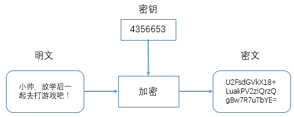
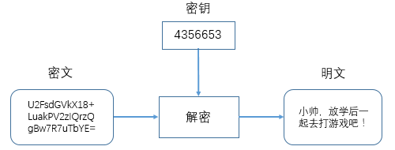
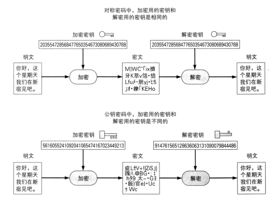

### 一、加密、解密、密钥与密码破译
同学们在上学时都有过传小纸条的经历吧？我们来试想一个场景：
在上自习课时，`小明`想给`小帅`传一个小纸条，可是他们中间还隔着个`小黑`，不管是扔纸条还是通过小黑帮忙传递，小纸条上的内容都有可能会被小黑同学看到。
聪明的小明早就想到了这一点，所以，他与小帅私下里制定了一种规则：这个规则可以将正常的文字转换成他人理解不了的文字或符号，也能将转换后的文字和符号恢复成正常文字的规则，这个规则我们可以称为`密码算法`，简称`密码`。在传纸条之前，把小纸条上的信息用该规则重新编写，这就是对信息的`加密`。当小帅收到纸条后，再用这个规则对纸条上的信息进行解读，这个过程称为`解密`。加密前的信息称为`明文`，加密后的信息称为`密文`。
然而，坐在两人之间的小黑借着帮忙传纸条（或在小明扔纸条时被小黑截获）的机会悄悄的复制了一份纸条上的信息，并利用自己对他俩人的了解（个人信息、习惯等）
猜测他俩约定的加密解密的规则，小黑的这个行为称做`密码破译`。
密码算法中还需要`密钥`，它是干什么的呢？不要着急，在后面的具体例子中会为大家解释。






### 二、对称密码与公钥密码
`对称密码`：在加密和解密时使用`同一密钥`的方式。
`公钥密码`：在加密和解密时使用`不同密钥`的方式。公钥密码又称为`非对称密码`。
`混合密码系统`：将对称密码和公钥密码结合起来的密码方式。

### 三、古典密码
#### 3.1 凯撒密码

凯撒密码：凯撒密码属于古典密码的一种，通过将明文中所使用的的字母表按照一定的`字数“平移”`来进行加密。<br>
**举个栗子**<br>
对liming进行加密，`密钥`是3。<br>
为了便于区分，我们用小写字母表示明文，用大写字母小时密文。<br>
*加密过程*<br>
l->O;<br>
i->L;<br>
m->P;<br>
n->Q;<br>
g->J;<br>
所以加密结果是：`OLPLQJ`.<br>
凯撒密码的解密就是将密文字母按字母表顺序反向平移3个字母。<br>
在知道密钥的情况下，破译凯撒密码是非常简单的。当不知道密钥时，可以采用暴力破解的方式来破译密码。<br>
**比如**：凯撒密码的`秘钥`其实就都是字母平移的位数，字母表只有26个字母，那么秘钥也就只有0-25共26个秘钥（平移0个字母相当于没有加密）。暴力破解就是按照顺序把26个秘钥都试一遍，当然这些我们可以借助工具来完成。<br>
**加密代码**（`C语言`）
```C
#include <stdio.h>
#include <string.h>

int main()
{
    char passwd[100],encrypted[100];
    int i;
    int k;
    int t;
    int move;
    while(1)
    {
        printf("Enter message to be encrypted:");
        gets(passwd);
        printf("Enter shift amount(0-25):");
        scanf("%d%*c",&move);
        for(i=0; i<strlen(passwd);i++)
        {
            if(passwd[i] >= 'A' && passwd[i] <= 'Z')
            {
                passwd[i] = ((passwd[i]-'A')+move)%26+'A';
            }
            else if(passwd[i] >= 'a' && passwd[i] <= 'z')
            {
                passwd[i] = ((passwd[i]-'a')+move)%26+'a';
            }
        }
        printf("%s",passwd);
        printf("\n");
        break;

    }
    return 0;
}
```
我们用凯撒密码做为例子，再给大家说一下密钥概念和作用。
> 凯撒密码中的`密码算法`就是`字符平移`，字符`平移的位数`就是密钥，所以算法是固定的，而密钥是可变的。密钥是一种`参数`，它是在明文转换为密文或将密文转换为明文的算法中输入的`参数`。

***加密与解密都要用到密钥。密码中的密钥是保护数据的关键，所以，必须注意不要让密码中的密钥被他人获取到。***
#### 3.2简单替换密码
将明文中所使用的字母表替换为另一套字母表的密码称为`简单替换密码`。如下图所示：


简单替换密码的加密过程是依次将明文中的每一个字母按照替换表规制成另一个字母。按照上图，我们对明文CHINA进行加密。
C → K
H → S
I  → J
N → M
A → H
KSJMH就是加密后的密文。
`解密`时只要使用加密时使用的替换表进行`反向替换`即可。
由于在简单替换密码的解密中，需要用到加密时所使用的替换表，因此发送者和接收者必须事先同时拥有该替换表，而这份替换表也就相当于简单替换密码的密钥。
下边是转载自网络的简单替换密码加、解密的`C++`实现方法，该程序已经在VS2015环境中运行通过。欢迎同学们分享你们自己发现的认为比较好的实现方法。


	#include "stdafx.h"
	#include "iostream"
	#include "string"
	using namespace std;
	
	void Encrypt(string& strProclaime); // 加密算法
	void Decode(string& strCiphertext); // 解密算法
	
	int main()
	{
	    // 加密
	    cout<<"输入明文（小写）：";
	    string str;
	    cin>>str;
	    Encrypt(str);
	    cout<<"加密密文（大写）："<<str<<endl;
	
	    // 解密
	    cout<<endl;
	    cout<<"输入密文（大写）：";
	    cin>>str;
	    Decode(str);
	    cout<<"解密明文（小写）："<<str<<endl;
	
	    system("pause"); 
	    return 0;
	}
	
	// 加密算法
	void Encrypt(string& strProclaime)
	{
	    for(int i=0;i<strProclaime.length();i++)
	    {
	        // 处理a-x
	        if(strProclaime[i] >='a' && strProclaime[i] <'x') 
	            strProclaime[i]+=2;
	        else if(strProclaime[i]=='y') // 处理y
	            strProclaime[i]='a';
	        else if(strProclaime[i]=='z') // 处理z
	            strProclaime[i]='b';
	        // 转为大写
	        strProclaime[i]-=32;
	    }
	}
	
	// 解密算法
	void Decode(string& strCiphertext)
	{
	    for(int i=0;i<strCiphertext.length();i++)
	    {
	        // 处理C-Z
	        if(strCiphertext[i] >='C' && strCiphertext[i] <='Z') 
	            strCiphertext[i]-=2;
	        else if(strCiphertext[i]=='A') // 处理A
	            strCiphertext[i]='Y';
	        else if(strCiphertext[i]=='B') // 处理B
	            strCiphertext[i]='Z';
	        // 转为小写
	        strCiphertext[i]+=32;
	    }
	}
#### 3.3置换密码
`置换密码`又称`换位密码`，明文和密文的字母相同，但是顺序被打乱。解密方式有点类似于拼图游戏，换位密码的加密方法有很多种。最简单的有单行置换加密，基于数组的置换密码，等等。最简单的置换码就是`栅栏密码`。<br>
#### 3.4栅栏密码
`栅栏密码`：就是把要加密的明文分成N个一组，然后把每组的第1个字，第二个字，第三个字。。。。连起来，形成一段无规律的话。不过栅栏密码本身有一个潜规则，就是组成栅栏的字母一般不会太多。<br>
**再举个栗子**
明文：guan guan ju jiu zai he zhi zhou;<br>
去掉空格分成两两一组（2栏的栅栏加密，秘钥为2）：gu an gu an ju ji uz ai he zh iz ho u ;最后一组不足两个可以补上任意字母或空格。<br>
提取第一个字符：gagajjuahzihu;<br>提取第二个字符：ununuiziehzo;<br>两串字符连接就是密文：gagajjuahzihuununuiziehzo;<br>
>g . a . g . a . j . j . u . a . h . z . i . h . u
. u . n . u . n . u . i . z . i . e . h . z . o .    
>

**解密**：将密文分成两段：<br>
第一段：gagajjuahzihu<br>
第二段：ununuiziehzo<br>
最后将两串字符交叉连接：guanguanjujiuzaihezhizhou;最后手动插入空格，就可以知道明文的内容了。<br>
除了2栏的栅栏码，还有多栏栅栏码，加解密方法相近，同学们可以自行拓展。<br>

*上述内容只是介绍了最简单的加密方法，各位同学可以自行查找资料,拓展不同的加密形式*

#### 小测验：
	1.获取下面凯撒密码中的KEY值：
	CQN ZDRLT KAXFW OXG SDVYB XENA CQN UJIH MXP XO LJNBJA JWM HXDA DWRZDN BXUDCRXW RB YAVBYOPVAKRA

	2.获取下面简单替换码中的KEY值：
	DA RZY LVPWMZRA MEX AEG JLT SYLX RZWB PA QSWYTX W LP WPNSYBBYX FYSA KYVV XETY AEGS BEVGRWET UYA WB BZSYZBVPXQZQ RZWB VWRRVY JZLVVYTMY KLB TER REE ZLSX KLB WR

	3.获取下面简单置换码中的KEY值
	oWdnreuf.lY uoc nar ae dht eemssga eaw yebttrew eh nht eelttre sra enic roertco drre . Ihtni koy uowlu dilekt  oes eoyrup sawsro don:wf nsedergmam.r

	4.将下面的明文用栅栏密码加密，密钥为3。写出加密后的密文（要求写出加密过程，最好是图示，图示样式参考上文）：
	guan guan ju jiu zai he zhi zhou
